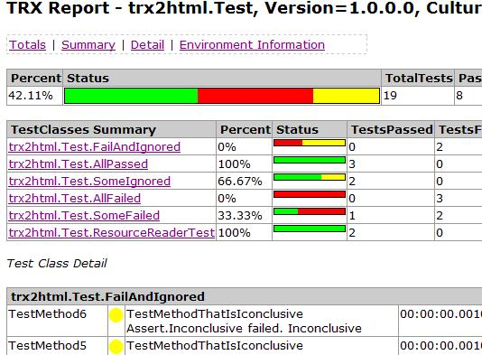

**Project Description**
Converts Visual Studio TestResults files to html with agregate information, making easier the inspection of test results

Version 0.6 supports Test Results for VS2005, 2008 and 2010

Version 0.7. Is based on LINQ (easier to mantain) but only supports TestResults created with VS2010, and requires .Net 4.0

**Update 26Jan2013 Versión 0.7.3 supports trx created with VS 2012**

[CurrentFeatures](CurrentFeatures)

More info on: [http://blogs.msdn.com/b/rido/archive/tags/trx2html](http://blogs.msdn.com/b/rido/archive/tags/trx2html)
